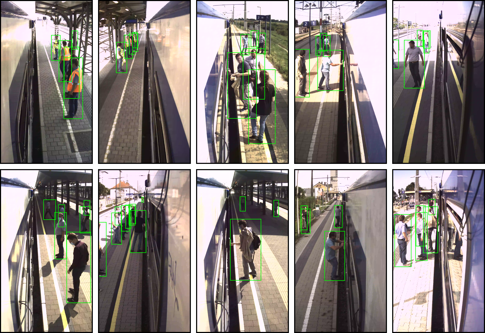

# RailEye3D Dataset


This repository provides annotations for the RailEye3D dataset, a collection of train-platform scenarios for applications targeting passenger safety and automation of train dispatching. 
It consists of 10 image sequences captured at 6 railway stations in Austria.
The corresponding image data can be requested by [email](mailto:daniel.steininger@ait.ac.at).


## Annotation Format
We provide annotations for multi-object tracking in both our own unified format as well as the ground-truth format used in the [MOTChallenge](https://motchallenge.net/).
* [anno/unified/bboxes](anno/unified/bboxes) contains csv-files for each frame with object instances defined as: `TLx, TLy, BRx, BRy, labelName, objectId`
* [anno/unified/params](anno/unified/params) provides the additional parameters `degree_of_occlusion, beyond_safety_line`
* [anno/mot](anno/mot) contains MOT-compatible gt-files for each sequence


Each sequence name contains a prefix corresponding to one of the following railway stations:
* red-00: Stockerau
* red-01: Hausleiten
* red-02: Absdorf-Hippersdorf
* red-03: Kirchberg am Wagram
* red-04: Fels
* red-06: Etsdorf-Straß


## Licence
The RailEye3D dataset is released to academic and non-academic entities for non-commercial purposes such as academic research, teaching, scientific publications, or personal experimentation ([LICENCE](LICENCE)).


## Acknowledgement
We would like to thank our industry partner EYYES GmbH and the Federal Austrian Railways (ÖBB) for enabling the recordings, and Marlene Glawischnig and Vanessa Klugsberger for support in annotation.


## Citing
If you use the dataset for your research, please use the following BibTeX entry.

```BibTeX
@misc{Wallner2021RailEye3D,
  author =       {Marco Wallner and Daniel Steininger and Verena Widhalm and Matthias Schoerghuber and Csaba Beleznai},
  title =        {RGB-D Railway Platform Monitoring and Scene Understanding for Enhanced Passenger Safety},
  howpublished = {\url{http://campus.pub.ro/RISS2020/program.html}},
  year =         {2021}
}
```